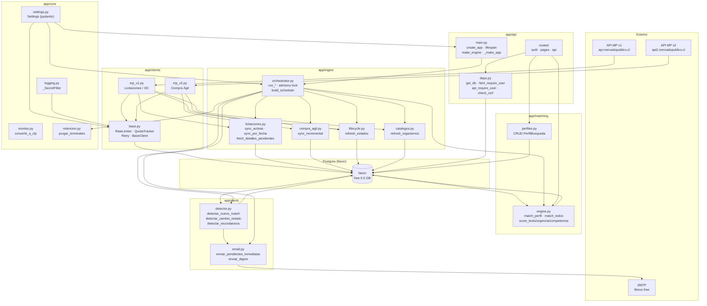

# Arquitectura — mp-oportunidades

## Diagrama de módulos y flujo de datos

---

## Decisiones de diseño

### Render + Neon (free tier)

**Por qué:** costo operativo $0. Render free provee un web service con 512 MB RAM; Neon free provee 0.5 GB de Postgres con branching nativo (dev/production).

**Restricciones resultantes:**
- El proceso es **desechable**: Render lo duerme tras 15 min de inactividad y lo reinicia en deploys. Todo estado persiste en Postgres (cuota, cursores, locks).
- RAM limitada: la ingesta procesa en lotes (nunca un día completo en memoria); max. candidatos de FTS = 500.
- Disco efímero: `raw_json` solo se guarda en oportunidades con al menos un match.

### Retención de datos

Los registros `raw_json` de oportunidades en estado terminal se purgan automáticamente a los 90 días (`purgar_terminales` corre a las 03:00 Chile). El objetivo es mantener el tamaño de la BD bajo 400 MB.

Las tablas `quota_log` y `sync_state` son compactas (1 fila por día/fuente) y nunca se purgan.

### Advisory lock (`pg_advisory_lock`)

Render puede levantar dos instancias simultáneas durante un deploy. Para evitar ingestas duplicadas, cada ciclo de ingesta adquiere `pg_try_advisory_lock(7891011)` al inicio y lo libera en `finally`. Si el lock está ocupado, el ciclo se omite con log de advertencia.

### Un ticket compartido

ChileCompra emite un ticket por cuenta registrada. El presupuesto de 9.000 req/día (de las 10.000 disponibles) es compartido por todos los jobs. La `QuotaTracker` persiste el consumo en `quota_log` y lanza `QuotaExceededError` cuando se supera el presupuesto, abortando limpiamente.

### psycopg3 con prefijo `postgresql+psycopg://`

Se usa `psycopg[binary]>=3.1` (psycopg3) que es el dialecto nativo de SQLAlchemy 2. La URL debe usar el prefijo `postgresql+psycopg://`; el prefijo `postgresql://` activa psycopg2 que no está instalado. El parámetro `sslmode=require` es obligatorio para Neon.

### Branches Neon dev/production

- Branch `production`: la usa Render. Las migraciones se aplican automáticamente en cada deploy (`alembic upgrade head` en startCommand).
- Branch `dev`: la usan los desarrolladores localmente y en CI. Protegida por la fixture `db_url` que falla si `DATABASE_URL == DATABASE_URL_PROD`.

---

## Limitaciones conocidas

### Gotchas de la API de Mercado Público

- **v1**: formato de fecha `ddmmaaaa` (no ISO); campos binarios inconsistentes (0/1/2/"NO"/True/null); `Listado` puede ser ausente, vacío o no-lista.
- **v2**: `codigo_orden_compra` es null aunque exista OC (usar `id_orden_compra`); envelope `{success, payload, errors}`; paginación máxima de 50 ítems.
- **Compra Ágil** no filtra por organismo en la API; se filtra localmente por región.
- Tipologías y estados de OC tienen erratas en los códigos oficiales; se usan tal cual y los desconocidos van al enum `DESCONOCIDO`.

### Tasas de cambio configuradas a mano

Las tasas UF, UTM, USD, EUR son variables de entorno (`TASA_UF`, `TASA_UTM`, etc.) que se deben actualizar mensualmente. No hay integración automática con el Banco Central. Los montos en moneda extranjera se convierten a CLP aproximado solo para el filtro de rango de monto en el matching.

### Rate limiting de login en memoria

Los intentos de login fallidos se cuentan en memoria (`threading.Lock`). Con `WEB_CONCURRENCY=1` (único worker en Render free), esto funciona correctamente. Si en el futuro se aumenta la concurrencia o se escala horizontalmente, el límite real será N × 5 intentos (donde N es el número de workers). Para producción multi-worker, migrar a un contador en Redis o en Postgres.

### `WEB_CONCURRENCY=1` en Render free

El plan free de Render no garantiza recursos suficientes para más de un worker de uvicorn. El `render.yaml` no setea `WEB_CONCURRENCY` explícitamente; uvicorn arranca con 1 worker por defecto. Si se sube de plan, agregar `WEB_CONCURRENCY=2` (o más) y migrar el rate-limit de login.
